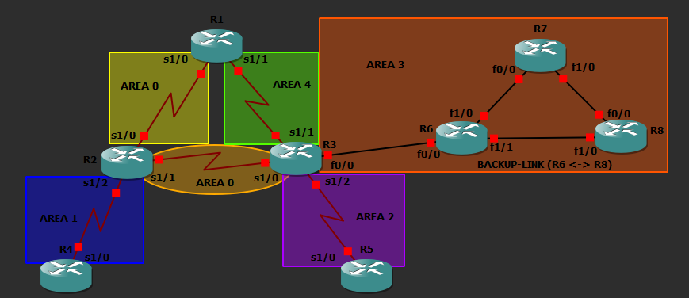

# Multi-Area OSPF Network Implementation


## 📌 Opis projektu

Projekt przedstawia praktyczną implementację protokołu OSPF w środowisku GNS3. Topologia została zbudowana z wykorzystaniem routerów Cisco C7200. Celem projektu było skonfigurowanie sieci multi-area OSPF, sprawdzenie działania routingu dynamicznego oraz przygotowanie scenariusza z trasą zapasową opartą o manipulację `OSPF cost`.

Projekt powstał jako laboratorium sieciowe dotyczące protokołu OSPF i może służyć jako przykład konfiguracji routingu dynamicznego w środowisku symulowanym.

## 🎯 Założenia projektu

W projekcie skonfigurowano topologię składającą się z ośmiu routerów Cisco C7200. Sieć została podzielona na kilka obszarów OSPF, w tym główny obszar backbone `Area 0` oraz dodatkowe obszary: `Area 1`, `Area 2`, `Area 3` i `Area 4`.

Najważniejsze założenia:

- konfiguracja OSPFv2 dla IPv4,
- zastosowanie topologii multi-area OSPF,
- wykorzystanie adresacji (maski) `/30`,
- użycie połączeń `Serial` oraz `FastEthernet`,
- konfiguracja routingu dynamicznego na routerach Cisco,
- manipulacja parametrem `OSPF cost`,
- przygotowanie `backup link` pomiędzy R6 i R8,
- analiza scenariusza `failover`.

## 🧪 Środowisko laboratoryjne

Projekt został wykonany w środowisku:

- GNS3,
- Cisco C7200,
- OSPFv2,
- IPv4,
- połączenia `Serial`,
- połączenia `FastEthernet`.

## 🗺️ Topologia

Topologia składa się z 8 routerów:

- R1,
- R2,
- R3,
- R4,
- R5,
- R6,
- R7,
- R8.

Sieć została podzielona na kilka obszarów OSPF:

| OSPF area | Routery / połączenia |
|---|---|
| Area 0 | R1 - R2, R2 - R3 |
| Area 1 | R2 - R4 |
| Area 2 | R3 - R5 |
| Area 3 | R3 - R6, R6 - R7, R7 - R8, R6 - R8 |
| Area 4 | R1 - R3 |

## 🖼️ Schemat topologii



Docelowo screen topologii znajduje się tutaj:

```txt
screenshots/gns3-topology.png
```

## 🌐 Adresacja

W projekcie wykorzystano adresację punkt-punkt `/30` dla każdego linku router-router.

| Połączenie | Sieć | OSPF area |
|---|---|---|
| R1 - R2 | `192.168.12.0/30` | Area 0 |
| R2 - R3 | `192.168.23.0/30` | Area 0 |
| R1 - R3 | `192.168.13.0/30` | Area 4 |
| R2 - R4 | `192.168.24.0/30` | Area 1 |
| R3 - R5 | `192.168.35.0/30` | Area 2 |
| R3 - R6 | `192.168.36.0/30` | Area 3 |
| R6 - R7 | `192.168.37.0/30` | Area 3 |
| R7 - R8 | `192.168.38.0/30` | Area 3 |
| R6 - R8 | `192.168.39.0/30` | Area 3 |

Pełna tabela adresacji znajduje się w pliku:

[`docs/addressing-plan.md`](docs/addressing-plan.md)

## 🔁 Scenariusz failover

W `Area 3` przygotowano scenariusz z trasą podstawową oraz zapasową.

Ścieżka podstawowa:

```txt
R6 -> R7 -> R8
```

Ścieżka zapasowa:

```txt
R6 -> R8
```

Bezpośredni link R6 - R8 został skonfigurowany jako `backup link` poprzez ustawienie wyższego parametru `OSPF cost`.

| Router | Interface | Link | OSPF cost | Rola |
|---|---|---|---|---|
| R6 | FastEthernet1/0 | R6 - R7 | 1 | Link podstawowy |
| R6 | FastEthernet1/1 | R6 - R8 | 100 | Backup link |
| R8 | FastEthernet0/0 | R8 - R7 | 1 | Link podstawowy |
| R8 | FastEthernet1/0 | R8 - R6 | 100 | Backup link |

Pełny opis scenariusza znajduje się w pliku:

- [`docs/failover-scenario.md`](docs/failover-scenario.md)

## ⚙️ Konfiguracje routerów

Konfiguracje routerów znajdują się w katalogu:

```txt
configs/
```

## Pliki konfiguracyjne:

- [`configs/R1.txt`](configs/R1.txt)
- [`configs/R2.txt`](configs/R2.txt)
- [`configs/R3.txt`](configs/R3.txt)
- [`configs/R4.txt`](configs/R4.txt)
- [`configs/R5.txt`](configs/R5.txt)
- [`configs/R6.txt`](configs/R6.txt)
- [`configs/R7.txt`](configs/R7.txt)
- [`configs/R8.txt`](configs/R8.txt)

## 📚 Dokumentacja

Dodatkowa dokumentacja znajduje się w katalogu:

```txt
docs/ :
```
- [`docs/addressing-plan.md`](docs/addressing-plan.md)
- [`docs/ospf-area-design.md`](docs/ospf-area-design.md)
- [`docs/failover-scenario.md`](docs/failover-scenario.md)
- [`docs/Referat_OSPF_Osowski.docx`](docs/Referat_OSPF_Osowski.docx)


## ✅ Weryfikacja działania

Do sprawdzenia działania konfiguracji można wykorzystać komendy:

```bash
show ip interface brief
show ip ospf neighbor
show ip route
show ip route ospf
show ip protocols
show ip ospf database
```

Przykładowe testy:

```bash
traceroute 192.168.38.2
ping 192.168.38.2
```

## 📁 Struktura repozytorium

```txt
multi-area-ospf-network-implementation/
│
├── README.md
│
├── configs/
│   ├── R1.txt
│   ├── R2.txt
│   ├── R3.txt
│   ├── R4.txt
│   ├── R5.txt
│   ├── R6.txt
│   ├── R7.txt
│   └── R8.txt
│
├── docs/
│   ├── addressing-plan.md
│   ├── ospf-area-design.md
│   ├── failover-scenario.md
│   └── Referat_OSPF_Osowski.docx
│
├── screenshots/
│   └── gns3-topology.png
│
└── verification/
    ├── show-ip-ospf-neighbor.txt
    ├── show-ip-route-ospf.txt
    └── failover-test.txt
```

## 🧠 Umiejętności pokazane w projekcie

Projekt pokazuje praktyczne umiejętności z zakresu:

- konfiguracji routerów Cisco,
- pracy z Cisco IOS,
- konfiguracji OSPFv2,
- projektowania sieci multi-area OSPF,
- adresacji IPv4 i podsieci `/30` (CIDR),
- analizy `routing table`,
- manipulacji `OSPF cost`,
- projektowania ścieżek zapasowych,
- testowania scenariusza `failover`,
- dokumentowania projektu

## 👤 Autor

Błażej Osowski
