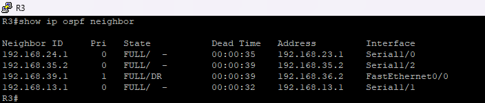
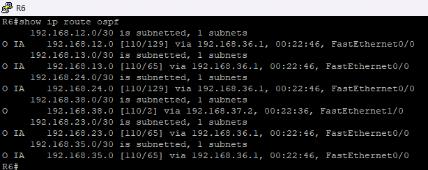
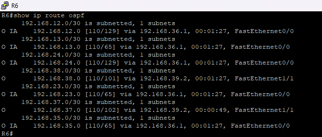
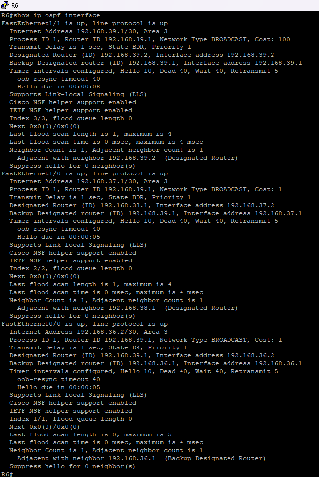
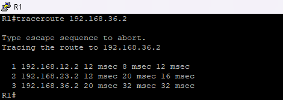
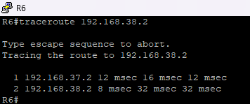
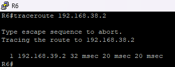
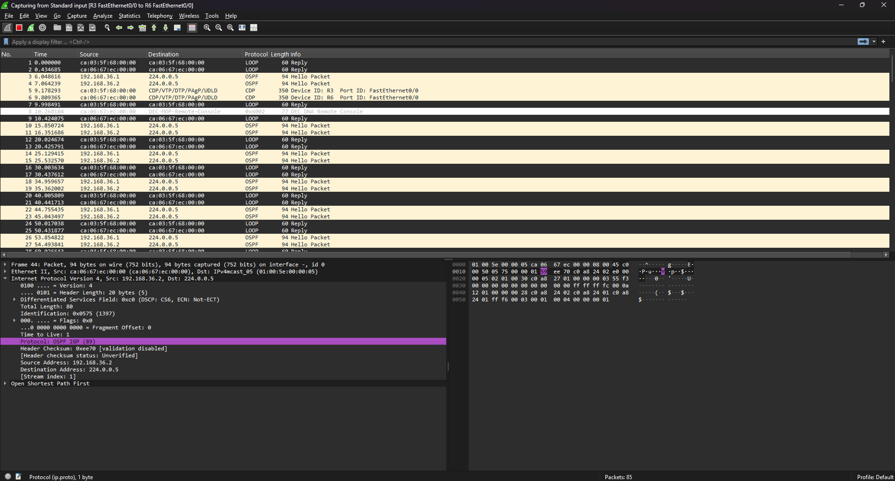
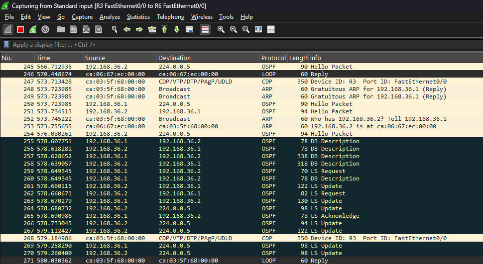

# Weryfikacja działania OSPF

Ten katalog zawiera screeny z konsoli routerów Cisco C7200 oraz z programu Wireshark w środowisku GNS3. Celem jest pokazanie, że konfiguracja OSPF działa poprawnie, routery uczą się tras dynamicznie, a ruch przechodzi przez odpowiednie obszary OSPF.

## 1. Sprawdzenie sąsiedztw OSPF na R3

Komenda:

```bash
show ip ospf neighbor
```

Komenda pokazuje routery sąsiednie OSPF oraz stan relacji sąsiedztwa. Poprawnie działające sąsiedztwo powinno znajdować się w stanie `FULL`.

Na screenie widoczny jest wynik komendy `show ip ospf neighbor` wykonanej na routerze R3. Router posiada poprawnie zestawione sąsiedztwa OSPF z routerami R1, R2, R5 oraz R6.

Stan `FULL` oznacza, że routery poprawnie wymieniły informacje OSPF i posiadają zsynchronizowaną bazę LSDB. Przy połączeniach `Serial` widoczny jest zapis `FULL/-`, ponieważ na linkach point-to-point nie odbywa się wybór DR/BDR. Przy połączeniu `FastEthernet` widoczny jest zapis `FULL/DR`, co oznacza, że sąsiedni router pełni rolę `Designated Router` na tym segmencie.



---

## 2. Sprawdzenie tras OSPF na R6 przed awarią

Komenda:

```bash
show ip route ospf
```

Komenda pokazuje trasy, których router nauczył się dynamicznie przez OSPF. Dzięki temu można potwierdzić, że router otrzymuje informacje o sieciach znajdujących się w innych obszarach.

Na screenie widoczna jest tablica tras OSPF na routerze R6 przed awarią linku podstawowego. Szczególnie istotna jest trasa do sieci `192.168.38.0/30`, czyli do połączenia R7 - R8.

Przed awarią R6 wybiera trasę do `192.168.38.0/30` przez R7:

```txt
via 192.168.37.2, FastEthernet1/0
```

Oznacza to, że ruch z R6 do R8 powinien przechodzić ścieżką podstawową:

```txt
R6 -> R7 -> R8
```



---

## 3. Sprawdzenie tras OSPF na R6 po awarii

Komenda:

```bash
show ip route ospf
```

Na tym screenie widoczna jest tablica tras OSPF na routerze R6 po awarii ścieżki podstawowej przez R7.

Po awarii R6 wybiera trasę do sieci `192.168.38.0/30` przez bezpośredni link do R8:

```txt
via 192.168.39.2, FastEthernet1/1
```

Oznacza to, że OSPF automatycznie przeliczył trasę i przekierował ruch na `backup link`:

```txt
R6 -> R8
```



---

## 4. Sprawdzenie kosztów OSPF na R6

Komenda:

```bash
show ip ospf interface
```

Komenda pokazuje szczegółowe informacje o interface biorących udział w procesie OSPF. W wyniku można sprawdzić m.in. adres IP interface, przypisany `Area ID`, typ sieci OSPF, stan DR/BDR oraz koszt OSPF.

Na screenie widoczne są koszty OSPF skonfigurowane na routerze R6:

- `FastEthernet1/1` - adres `192.168.39.1/30`, link R6 - R8, `Cost: 100`,
- `FastEthernet1/0` - adres `192.168.37.1/30`, link R6 - R7, `Cost: 1`,
- `FastEthernet0/0` - adres `192.168.36.2/30`, link R6 - R3, `Cost: 1`.

Najważniejszy w tym teście jest interface `FastEthernet1/1`, czyli bezpośredni link R6 - R8. Ma on ustawiony wyższy koszt `100`, dlatego OSPF traktuje go jako trasę zapasową.

Dzięki temu w normalnych warunkach ruch z R6 do R8 przechodzi ścieżką:

```txt
R6 -> R7 -> R8
```

a bezpośredni link:

```txt
R6 -> R8
```

jest wykorzystywany dopiero po awarii ścieżki podstawowej.



---

## 5. Test przejścia ruchu przez backbone Area 0

Komenda:

```bash
traceroute 192.168.36.2
```

Komenda `traceroute` pokazuje kolejne routery, przez które przechodzi pakiet do wskazanego adresu IP.

W tym teście sprawdzana jest komunikacja z R1 do R6. Adres `192.168.36.2` należy do routera R6 na połączeniu R3 - R6.

Oczekiwana ścieżka:

```txt
R1 -> R2 -> R3 -> R6
```

Na screenie widać, że ruch przechodzi przez backbone `Area 0`, a następnie trafia do `Area 3`. To potwierdza poprawne działanie routingu między obszarami OSPF.



---

## 6. Test ścieżki podstawowej w Area 3

Komenda:

```bash
traceroute 192.168.38.2
```

Ten test pozwala sprawdzić, którędy przechodzi ruch z R6 do R8 przed awarią linku podstawowego.

Oczekiwana ścieżka przed awarią:

```txt
R6 -> R7 -> R8
```

Na screenie widać, że OSPF wybrał trasę przez R7, ponieważ ta ścieżka ma niższy `OSPF cost`.



---

## 7. Test ścieżki zapasowej po awarii

Komenda:

```bash
traceroute 192.168.38.2
```

Po awarii głównej ścieżki OSPF wybiera bezpośredni link R6 - R8, który wcześniej pełnił rolę `backup link`.

Oczekiwana ścieżka po awarii:

```txt
R6 -> R8
```

Na screenie widać, że ruch został przekierowany na trasę zapasową. Potwierdza to poprawne działanie scenariusza `failover`.



---

## 8. Analiza pakietów OSPF Hello w Wireshark

Do dodatkowej weryfikacji działania protokołu OSPF wykorzystano Wireshark. Przechwytywanie zostało uruchomione na linku pomiędzy routerami R3 i R6 w środowisku GNS3.

OSPF działa bezpośrednio na warstwie IP i wykorzystuje numer protokołu `89`, widoczny w Wireshark jako `OSPFIGP`.

Pakiety `Hello Packet` służą do wykrywania sąsiadów OSPF oraz utrzymywania relacji sąsiedztwa.

Na screenie widoczne są cykliczne pakiety OSPF wysyłane na adres multicast `224.0.0.5`, czyli do wszystkich routerów OSPF na danym segmencie.

W przechwytywaniu można zauważyć:

- protokół `OSPF`,
- pakiety `Hello Packet`,
- adres multicast `224.0.0.5`,
- pole `Protocol: OSPFIGP (89)`.



Widoczność pakietów `Hello Packet` potwierdza, że routery OSPF aktywnie utrzymują relację sąsiedztwa na analizowanym linku.

---

## 9. Wymiana informacji LSDB w Wireshark

Na kolejnym screenie widoczny jest moment intensywniejszej wymiany komunikatów OSPF pomiędzy routerami R3 i R6. Taka wymiana pojawia się m.in. podczas zestawiania sąsiedztwa, synchronizacji baz LSDB albo po zmianie stanu linku.

W przechwyconym ruchu widoczne są różne typy pakietów OSPF:

- `DB Description` - pakiety używane do porównania zawartości baz LSDB pomiędzy routerami,
- `LS Request` - żądania konkretnych informacji LSA, których router jeszcze potrzebuje,
- `LS Update` - pakiety przesyłające informacje LSA o stanie łączy,
- `LS Acknowledge` - potwierdzenia odebrania informacji LSA,
- `Hello Packet` - pakiety utrzymujące sąsiedztwo OSPF.

Na screenie widać komunikację pomiędzy adresami `192.168.36.1` i `192.168.36.2`, czyli na linku R3 - R6 w `Area 3`.



Ten screen potwierdza, że routery nie tylko wysyłają pakiety `Hello`, ale również wymieniają informacje o topologii sieci. Jest to istotne, ponieważ właśnie na podstawie LSDB routery OSPF obliczają najlepsze trasy za pomocą algorytmu SPF.

### Widoczny ruch ARP

Na screenie oprócz pakietów OSPF widoczne są również pakiety `ARP`. Nie są one częścią protokołu OSPF, ale pojawiają się naturalnie na linku Ethernet, ponieważ routery muszą znać adresy MAC sąsiadów w tej samej sieci lokalnej.

Przykładowy komunikat ARP widoczny w przechwytywaniu:

```txt
Who has 192.168.36.2? Tell 192.168.36.1
```

Oznacza to, że urządzenie o adresie `192.168.36.1` pyta o adres MAC urządzenia posiadającego adres IP `192.168.36.2`.

Odpowiedź ARP:

```txt
192.168.36.2 is at ca:06:67:ec:00:00
```

oznacza, że router z adresem `192.168.36.2` odpowiedział swoim adresem MAC.

Na screenie widoczny jest również `Gratuitous ARP`, czyli komunikat ARP wysyłany bez wcześniejszego zapytania. Może być używany m.in. do poinformowania innych urządzeń o własnym adresie IP/MAC albo do odświeżenia informacji w tablicach ARP.

W kontekście tego projektu ARP potwierdza działanie komunikacji lokalnej na linku FastEthernet R3 - R6, natomiast właściwa wymiana informacji routingu odbywa się przez pakiety OSPF.

---